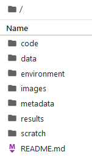
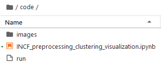

# INCF Workshop: Data Visualization

---

This capsule will walk you through preprocessing, clustering and visualization of [10X](https://www.10xgenomics.com/) data generated from [CellRanger](https://support.10xgenomics.com/single-cell-gene-expression/software/pipelines/latest/what-is-cell-ranger).

---

## Hot to run the jupyter notebook

1. Click on the Jupyter Lab Cloud Workstation icon in the top righthand corner.
    - 
2. When you are in Jupyter Lab, double click on the `code` folder
    - 
3. Double click on the jupyter notebook file called `INCF_preprocessing_clustering_visualization.ipynb`.
    - 
4. The notebook should now be open and you are ready to start the workshop.