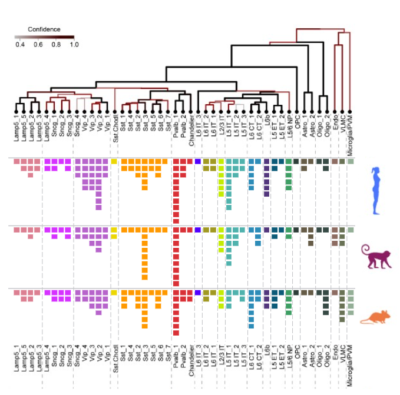

# INCF Tutorial: Cell Type Analysis and Visualization with Scanpy

---

The Allen Institute has generated a [transcriptomic atlas](https://knowledge.brain-map.org/celltypes) based on data from millions brain cells in the mouse, human, and macaque. These data enable the community to identify genetic cell types that can be targeted for analysis of cellular function. See [Hao et al. Cell 2021](https://www.cell.com/cell/fulltext/S0092-8674(21)00583-3) and [Yao et al. Nature 2021](https://www.nature.com/articles/s41586-021-03500-8) for more information.

This capsule will walk you through processing, clustering and visualization of some of the [10X](https://www.10xgenomics.com/) single-cell transcriptomics data collected from the [primary motor cortex of the adult mouse](https://knowledge.brain-map.org/celltypes/CCN202002013). Data has been preprocessed using [CellRanger](https://support.10xgenomics.com/single-cell-gene-expression/software/pipelines/latest/what-is-cell-ranger) in an upstream capsule.

---

## How to run the jupyter notebook

1. Click on the Jupyter Lab Cloud Workstation icon in the top righthand corner.
    - 
2. When you are in Jupyter Lab, double click on the `code` folder
    - 
3. Double click on the jupyter notebook file called `INCF_preprocessing_clustering_visualization.ipynb`.
    - 
4. The notebook should now be open and you are ready to start the workshop.